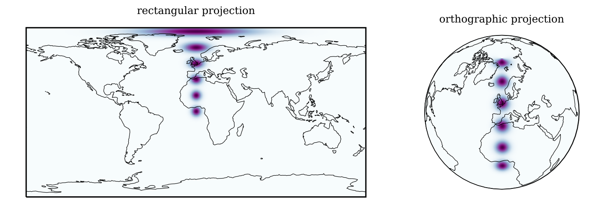
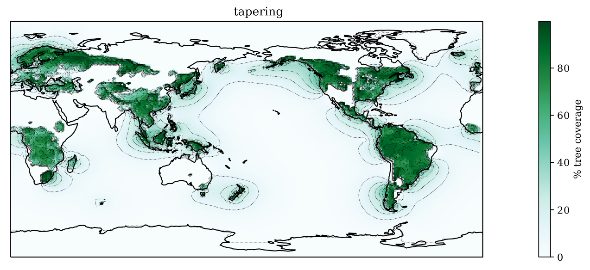

Introduction
=============

HyperCC computes the *Canny edge detector* on climate data.

The Canny edge detector (Canny 1987) is a generic algorithm for finding edges in gridded data. It consists of four stages:

* **Smoothing** the Canny algorithm relies on computing derivatives. Taking derivatives of data amplifies noise present in the data. To suppress this noise we should smooth our data to a chosen scale :math:`\sigma`.
* **Sobel operator** the Sobel operator does the action of computing a first order finite difference, while at the same time smoothing over the directions perpendicular to the axis of differentiation. In two dimensions, the Sobel operator can be described as a convolution with the following :math:`3 \times 3` matrix:

  .. math::
     S_{x} = \frac{1}{8} \begin{bmatrix}
     -1 & 0 & 1\\ -2 & 0 & 2\\ -1 & 0 & 1\end{bmatrix}.

  The matrix, :math:`S_{y}`, for computing the Sobel operator in the :math:`y`-direction is the transpose of :math:`S_{x}`.

* **Non-maximum suppression** we need to find places where the data has the largest gradient in the direction of this same gradient. We test every pixel for maximality, comparing it with two opposite pixels in the same :math:`3 \times 3` block. These two other pixels are chosen by looking at the direction of the gradient.
* **Hysteresis thresholding** edges are selected where the gradient magnitude :math:`|S|` (or absolute value of the gradient) is greater than a upper threshold :math:`a_{+}`. Edges with a gradient magnitude smaller than :math:`a_{+}` but larger than a lower threshold :math:`a_{-}` are only selected if they are connected to an edge where :math:`|S| > a_{+}`.

We apply this algorithm to climate datasets. These data are three-dimensional, set in spherical (Earth) coordinates and have both time and space dimensions. These properties all complicate the proper implementation of the Canny algorithm for climate data.

In designing the algorithm we tried to use stock functions (from existing Python packages, i.e. Numpy and SciPy) as much as possible. Both the Sobel operator and Gaussian smoothing are implemented in the ``scipy.ndimage`` module.

.. image:: canny4.png

Physical data and calibration
~~~~~~~~~~~~~~~~~~~~~~~~~~~~~~~
The data is represented on a grid with longitude, latitude and time axes. Leaving the problems of a spherical geometry to later section, derivatives in the time axis will have different units than those in the spatial directions. One of the most important steps in the Canny edge detector is the hysteresis thresholding, as it deals with the issue of noise. The hysteresis thresholding relies on the existence of a scalar response function from the Sobel operator. In our case however, such a scalar does not exist. There is no prefered way to combine the time and space components into a single scalar. The scaling between time and space :math:`\gamma` is a free paramater in our method, with dimensions of velocity. Given the space and time components of the Sobel operator, we compute the Sobel signal as

.. math::
    |S|^2 = \gamma S_{x}^2 + S_{t}^2.

A reasonable value for :math:`\gamma` can be obtained by comparing the distributions of space and time derivatives in the pre-industrial control samples, which should give a fair representation of the natural variability.

N-d non-maximum suppression
-------------------------------
The aim of non-maximum suppression is two-fold. We'd want to find edges on those pixels where :math:`|S|` is maximal, and we need edges to be connected when they belong to same feature.

There are many techniques for non-maximum suppression. We use a simple method that is easily implemented in :math:`N` dimensions. For each pixel :math:`\vec{p}` we take the unit vector of the gradient :math:`\hat{S}`, and round each component to the nearest integer value (-1, 0, or 1). This gives the coordinates of a pixel relative to the pixel under consideration. We compare the gradient magnitude :math:`|S|` of the pixel with the values on both sides, :math:`\vec{p} + \hat{S}` and :math:`\vec{p} - \hat{S}`. If the value at :math:`\vec{p}` is higher than its two neighbours, we keep :math:`\vec{p}` as a point lying on an edge.

Physical and image representations
-----------------------------------
We've discussed how the Sobel operator has physical meaning in terms of a derivative. We introduced a scaling factor :math:`\gamma` so that we could control the relative influence of edges in space versus time directions. When doing non-maximum suppression we need to make sure that single features remain connected in our edge detector. To achieve this we need to use directional information that is isotropic on the image grid; that is to say, we apply part of the algorithm agnostic to the physical meaning and geometry of the grid. Still, we want to optimize edges for the signal :math:`|S|`. To this end we create a hybrid Sobel vector :math:`\tilde{S}` that contains the physical magnitudes, but obtains its direction from the image representation.

Rescaling vector components by some positive factor changes the direction of the resulting vector, but never the quadrant in which it lies. By applying non-maximum suppression on the hybrid Sobel vector, we ensure both our requirements (of maximality and connectivity) are met.

Spherical coordinates
~~~~~~~~~~~~~~~~~~~~~

   Smoothing on a sphere, rectangular and orthographic projections: We test the accuracy of our method of smoothing in spherical coordinates by plotting a line of pixels on the grid, running from the equator to the pole.
   We smoothed using a Gaussian kernel, correcting for the spherical distortion of the grid. Closer to the pole the resulting blob is distorted slightly. However, we assume that this approach is good enough for our purposes, since no iteration is involved that could amplify these distortions.

When smoothing and computing derivatives we need to account for the geometric distortion of the Earth grid. For the derivatives we do this by dividing the output of the Sobel operator with

.. math::
   \mu = \cos \varphi,

where :math:`\varphi` is the latitude.

A nice property of Gaussian smoothing is that it can be done separately in each dimension. We correct for the spherical geometry of the grid by taking a factor :math:`\mu` in the standard deviation when smoothing in the longitudinal direction. We assume this approach is good enough for our purposes: we want to have an equal probability for finding features of a certain magnitude irrespective of latitude.

Mask tapering
~~~~~~~~~~~~~~

   Mask tapering: by repeatedly smoothing the data, and replacing the unmasked regions with the original, values for tree coverage on land *bleed* into the oceans. This should mitigate effects of smoothing over regions where no value for the tree coverage is known (i.e. oceans). Dotted lines are placed at :math:`10\%` intervals. The tree coverage data is from the PI-Control sample of the HadGEM2-ES model.

Many climate variables only have values on land (or only on sea). To make sure that these land-sea masks don't give us false edges, we apply a *tapering* routine before the rest of the analysis. The tapering routine is an iterative procedure consisting of just two steps. Given a smoothing scale :math:`\sigma_{\rm taper}`, we repeat the following steps *N* times:

* Smooth entire (masked and unmasked) data set using a flat filter of width :math:`\sigma_{\rm taper}`.
* Replace the unmasked pixels with the original values.

We use a flat filter because it is faster than other filters and precision is not needed here. All we need is that the boundary of the land/sea mask doesn't show up as an artificial edge in our output, and that smoothing across continents and islands is not affected too much by the seas in between. For the best results we should choose a small :math:`\sigma_{\rm taper}` and a large :math:`N`; however taking a larger :math:`\sigma_{\rm taper}`, will lead to a faster convergence in large masked regions. Typical values for the tapering routine are a :math:`5 \times 5` pixel flat kernel, repeating :math:`N \sim 50` times.
